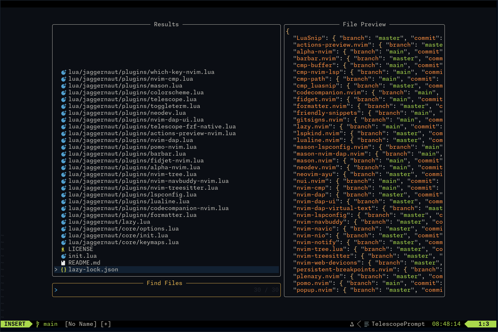
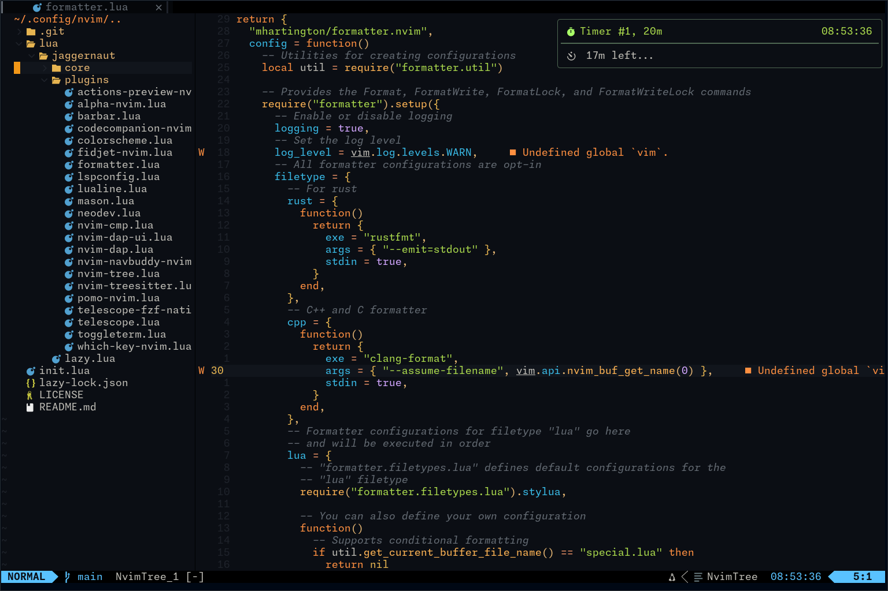

# Jaggernaut-PDE
My Personal Neovim config intended for Lua, C/C++ and Rust development.

# Screenshots

## Dashboard

## CodeAction

## CodeCompanion

## Terminal

## Timer

## Find Files

## Mav

